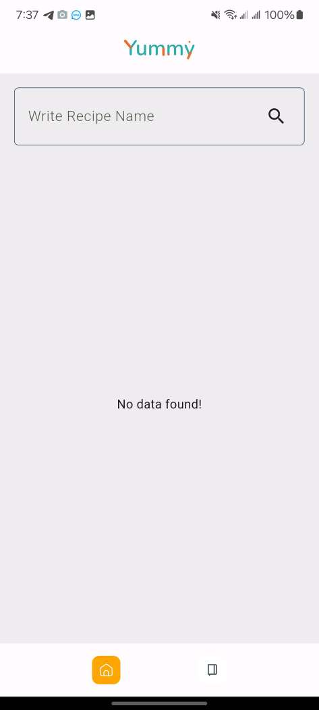
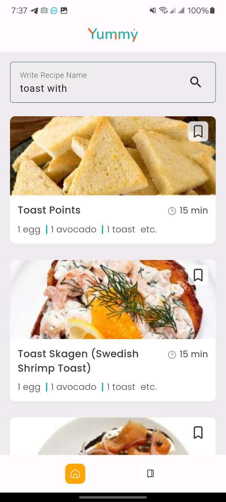
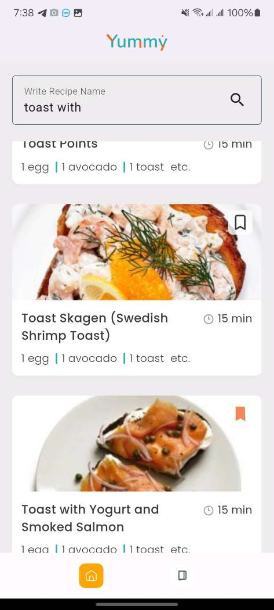
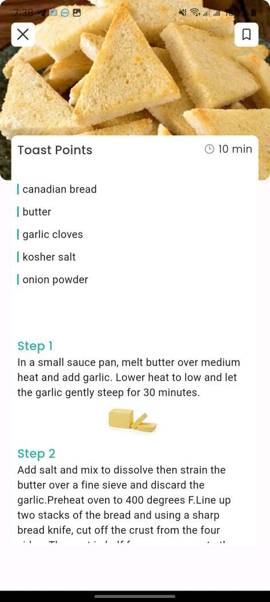

# Yummy Food Recipe App

## Project Scope

This project aims to develop a simple food recipe app with the following functionalities:

## Home Screen:

1. Upon opening the app, users will see a search bar.
2. Users can type the name of the recipe they want to search for in the search bar.
3. Search results will be dynamically updated based on the input using the "GET Find Recipe" API.
4. Display search results as cards or tiles, including recipe names, descriptions, and images.
5. Implement pagination for loading recipes.

## Recipe Details Screen:

1. When users click on a recipe card from the home screen or search results, they will navigate to the recipe details screen.
2. Display detailed information about the selected recipe, including ingredients, cooking instructions, and any additional notes.
3. Provide an option for users to save the recipe for later viewing.
4. Utilize the "GET Get Recipe Information" API to fetch recipe details.

## Save Functionality:

1. Implement a feature that allows users to save recipes for future reference.
2. Provide a way for users to access their saved recipes from within the app, such as a separate "Saved Recipes" screen or a favorites section.
3. Save the IDs of the "Saved Recipes" in local storage for offline access.

## Architecture and Design Patterns

- **MVVM (Model-View-ViewModel)**: Separates concerns and facilitates maintainability.
- **Repository Pattern**: Abstracts data layer for easier testing and scalability.

## State Management

- **Bloc (Business Logic Component)**: Manages application state using Bloc pattern for better organization and separation of concerns.

## Networking and Database

- **HTTP Client**: Utilizes `http` package for API requests.
- **SQFlite**: Stores fetched data locally with SQFlite package.

## Error Handling

- Centralized API call error handling provides meaningful feedback to users in case of network errors.

## Navigation

- Utilizes Flutter's built-in navigation system for seamless navigation between screens.

## GitHub Repository

The source code for this project is hosted on GitHub. You can access the repository [here](https://github.com/mFerdous/food_recipe).

## Screenshots

